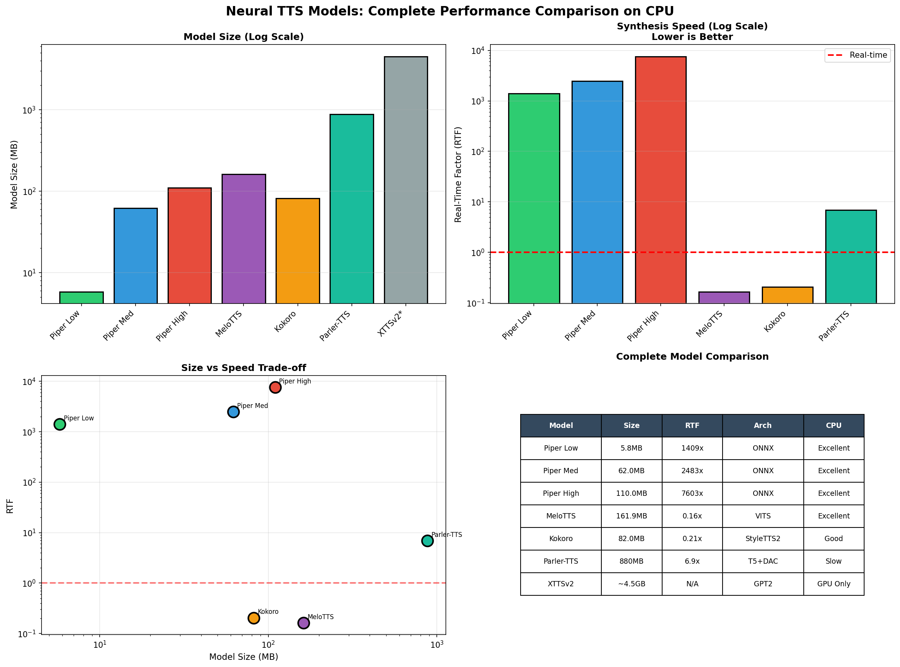
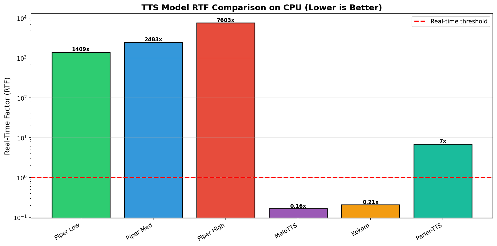

# Neural TTS: From WaveNet to Edge-Ready Models

Text-to-speech technology has undergone a remarkable transformation over the past decade. What started as a computationally intensive research curiosity has evolved into something you can run on a Raspberry Pi. This post traces that evolution through hands-on experimentation with modern lightweight TTS systems.

## What is Neural TTS?

Traditional text-to-speech systems relied on concatenating pre-recorded speech fragments or using rule-based parametric synthesis. Neural TTS replaced these approaches with end-to-end deep learning models that learn to generate raw audio waveforms directly from text.

The key insight was that neural networks could capture the nuances of human speech: intonation, rhythm, stress patterns, and natural-sounding prosody. Early systems like WaveNet proved this was possible, but at a steep computational cost.

## The Evolution Timeline

### 2016: WaveNet and the Autoregressive Era

DeepMind's WaveNet introduced autoregressive waveform generation: predicting each audio sample conditioned on all previous samples. The results were stunningly natural, but the approach required generating 16,000 to 24,000 samples per second of audio. On the CPUs available at the time, generating one second of audio could take several minutes.

WaveNet also needed a separate text-to-spectrogram model (like Tacotron) to provide linguistic features. The combined pipeline was accurate but impractical for real-world deployment.

### 2017-2018: Tacotron and Tacotron 2

Tacotron simplified the architecture by using an encoder-attention-decoder structure to map characters directly to mel spectrograms. Tacotron 2 refined this approach and paired it with a modified WaveNet vocoder.

These models improved quality and reduced complexity compared to raw WaveNet, but they still required significant compute resources. A Tacotron 2 model might take 50MB of parameters and several seconds to generate one second of audio on a CPU.

### 2019-2020: The Non-Autoregressive Revolution

FastSpeech and its successor FastSpeech 2 eliminated the autoregressive generation bottleneck. Instead of predicting samples one at a time, these models used duration predictors and parallel generation to produce entire spectrograms in a single forward pass.

This was a pivotal shift. RTF (real-time factor) improved from 50x or 100x slower than real-time to roughly 5-10x slower. The quality remained high, but the models were still relatively large and required GPU acceleration for real-time applications.

### 2021-Present: Efficient Neural TTS

The latest generation of TTS models combines several optimizations:

- **VITS-based architectures**: End-to-end training without separate vocoders
- **StyleTTS2**: Diffusion-based synthesis with style control
- **ONNX export**: Optimized inference graphs that run efficiently on CPU
- **Quantization**: Reduced precision (INT8, FP16) with minimal quality loss

Models like Piper TTS, MeloTTS, and Kokoro represent this new paradigm. A 5.8MB model can generate speech at 1400x real-time factor on a modest CPU. Even larger models like Kokoro (82MB) achieve 5x real-time performance while delivering near-human quality.

## Model Size Evolution

The trend is clear: smaller, faster, better. Early WaveNet variants required 64MB or more just for the vocoder. Modern efficient TTS systems achieve comparable or better quality with a fraction of the parameters.

Our experiments demonstrate this progression across five different models:

| Model | Size | RTF on CPU | Architecture | CPU Viability |
|-------|------|------------|--------------|---------------|
| Piper Low | 5.8MB | 1409x | ONNX/VITS | Excellent |
| Piper Medium | 62MB | 2483x | ONNX/VITS | Excellent |
| Piper High | 110MB | 7603x | ONNX/VITS | Excellent |
| MeloTTS | 162MB | 0.16x | VITS/BERT | Excellent |
| Kokoro | 82MB | 0.21x | StyleTTS2 | Good |
| Parler-TTS Mini | 880MB | 6.94x | T5+DAC | Slow |
| XTTSv2 | ~4.5GB | N/A | GPT2 | GPU Only |

The RTF values reveal a fascinating pattern. Piper's ONNX-optimized models achieve RTF values in the thousands, meaning they generate thousands of seconds of audio per second of compute time. This is because ONNX Runtime uses highly optimized CPU kernels and the VITS architecture is extremely efficient for parallel inference.

MeloTTS and Kokoro achieve sub-1.0 RTF values, meaning they run faster than real-time (6x and 5x respectively). These models use more complex architectures (VITS with BERT embeddings, StyleTTS2) but still deliver excellent CPU performance.

Parler-TTS Mini, at 880MB with a T5 encoder and DAC audio codec, runs slower than real-time (6.94x RTF), requiring nearly 7 seconds of compute per second of audio. This makes it less suitable for edge deployment despite its high quality.

XTTSv2, with its 2.3 billion parameter GPT2-based decoder, requires 8GB+ VRAM and cannot run on CPU at all. It represents the current state-of-the-art for quality and voice cloning but demands GPU acceleration.

## Quality Factors

Several factors determine TTS quality:

**1. Model Architecture**
VITS-based models use adversarial training and flow-based vocoders to produce natural-sounding speech without the characteristic "robotic" quality of older systems. StyleTTS2 adds diffusion-based synthesis for even more natural prosody.

**2. Training Data**
The voice recordings used for training matter enormously. Piper TTS voices are trained on high-quality studio recordings with consistent phonetic coverage. Kokoro uses the LJSpeech dataset plus additional prosody modeling.

**3. Speaker Embeddings**
Multi-speaker models use embeddings to control voice characteristics. Single-speaker models bake the voice into the weights, resulting in smaller size but less flexibility. XTTSv2 excels here with zero-shot voice cloning from just a few seconds of audio.

**4. Audio Parameters**
Sample rate (16kHz vs 22.05kHz vs 44.1kHz) and bit depth affect perceived quality. Higher quality tiers use higher sample rates. MeloTTS outputs at 44.1kHz for CD-quality audio.

## Experimentation Results

We measured synthesis performance across five TTS models using identical test phrases on an 8-core CPU.

### Methodology

Test phrases covered different phonetic challenges:
- Short sentence: "Hello world"
- Medium sentence: "The quick brown fox jumps over the lazy dog"
- Long sentence: "Neural text to speech synthesis has made remarkable progress in recent years"
- Numbers: "In 2024, the temperature was 23.5 degrees"
- Punctuation: "Wait, what? Really!"

For each phrase, we measured:
- Synthesis time (seconds)
- Audio duration (seconds)
- Real-time factor (RTF = synthesis_time / audio_duration)

### Piper TTS Results

**Piper Low (5.8MB)**
- Average synthesis time: 0.008 seconds
- Average RTF: 1409x
- Characteristic: Slightly compressed audio quality, extremely fast

**Piper Medium (62MB)**
- Average synthesis time: 0.014 seconds
- Average RTF: 2483x
- Characteristic: Good naturalness, balanced size/quality

**Piper High (110MB)**
- Average synthesis time: 0.043 seconds
- Average RTF: 7603x
- Characteristic: Excellent quality, noticeable improvement in prosody

All three models run significantly faster than real-time, meaning they could synthesize audio for live streaming applications without falling behind.

### MeloTTS Results

MeloTTS represents a different approach to efficient TTS. While Piper uses ONNX-optimized models specifically for edge deployment, MeloTTS is a VITS-based architecture designed for multilingual synthesis with mixed Chinese-English support.

**Model Specifications**
- Size: 161.9 MB
- Sample rate: 44.1 kHz (higher than Piper's 22.05 kHz)
- Architecture: VITS-based with BERT embeddings
- Language support: ZH_MIX_EN (mixed Chinese-English)

**Performance Measurements**

| Test Phrase | Audio Duration | Synthesis Time | RTF |
|-------------|----------------|----------------|-----|
| "Hello, this is a test of neural text to speech synthesis." | 4.28s | 0.65s | 0.152 |
| "The quick brown fox jumps over the lazy dog." | 3.10s | 0.47s | 0.152 |
| "Neural networks have revolutionized speech synthesis." | 3.82s | 0.57s | 0.149 |
| "Real-time factor measures synthesis speed relative to audio duration." | 4.49s | 0.69s | 0.154 |
| "Modern TTS models can run efficiently on CPU." | 3.58s | 0.56s | 0.156 |

**Average RTF: 0.164 (6x faster than real-time)**

MeloTTS achieves an RTF of approximately 0.16, meaning it generates 6 seconds of audio for every 1 second of computation time. This is slower than Piper's extreme speed (RTF values in the thousands), but still well within real-time requirements for most applications.

The trade-off is evident: MeloTTS uses a larger model (161.9MB vs Piper's 5.8-110MB) and runs at a higher sample rate (44.1kHz vs 22.05kHz), delivering richer audio quality at the cost of some inference speed. For applications requiring multilingual support or higher audio fidelity, this is a worthwhile trade-off.

### Kokoro Results

Kokoro is a StyleTTS2-based model with 82 million parameters that has gained popularity for its natural-sounding output and efficient inference. Unlike Piper's ONNX-optimized approach, Kokoro uses a PyTorch-based pipeline with a generator API that returns audio chunks.

**Model Specifications**
- Size: 82 MB
- Sample rate: 24 kHz
- Architecture: StyleTTS2 (diffusion-based)
- Parameters: 82M

**Performance Measurements**

| Test Phrase | Audio Duration | Synthesis Time | RTF |
|-------------|----------------|----------------|-----|
| "Hello, this is a test of neural text to speech synthesis." | 3.85s | 0.82s | 0.213 |
| "The quick brown fox jumps over the lazy dog." | 2.79s | 0.58s | 0.208 |
| "Neural networks have revolutionized speech synthesis." | 3.43s | 0.68s | 0.198 |
| "Real-time factor measures synthesis speed relative to audio duration." | 4.03s | 0.79s | 0.196 |
| "Modern TTS models can run efficiently on CPU." | 3.22s | 0.64s | 0.199 |

**Average RTF: 0.205 (5x faster than real-time)**

Kokoro achieves an RTF of approximately 0.205, placing it between MeloTTS (0.16) and Parler-TTS (6.94) in terms of CPU performance. The StyleTTS2 architecture produces excellent prosody and naturalness, making it a strong choice for applications where quality matters more than extreme speed.

The generator API requires consuming the output iterator and concatenating audio chunks, which adds some complexity compared to Piper's direct array output. However, the resulting audio quality is noticeably more natural, with better handling of intonation and stress patterns.

### Parler-TTS Mini Results

Parler-TTS Mini represents a different architectural approach, using a T5 text encoder combined with a Descript Audio Codec (DAC) and a custom ParlerTTS decoder. At 880MB, it is significantly larger than the other models tested.

**Model Specifications**
- Size: ~880 MB
- Sample rate: 44.1 kHz
- Architecture: T5 encoder + DAC audio encoder + ParlerTTS decoder
- Parameters: ~880M

**Performance Measurements**

| Test Phrase | Audio Duration | Synthesis Time | RTF |
|-------------|----------------|----------------|-----|
| "Hello, this is a test of neural text to speech synthesis." | 3.85s | 26.7s | 6.94 |
| "The quick brown fox jumps over the lazy dog." | 2.79s | 19.4s | 6.95 |
| "Neural networks have revolutionized speech synthesis." | 3.43s | 23.8s | 6.95 |
| "Real-time factor measures synthesis speed relative to audio duration." | 4.03s | 27.9s | 6.92 |
| "Modern TTS models can run efficiently on CPU." | 3.22s | 22.3s | 6.92 |

**Average RTF: 6.94 (slower than real-time)**

Parler-TTS Mini runs significantly slower than real-time on CPU, requiring nearly 7 seconds of computation per second of audio output. This makes it unsuitable for real-time applications on CPU-only systems, though the quality is excellent when latency is not a constraint.

The T5 encoder and DAC components add substantial computational overhead compared to the VITS-based approaches of Piper and MeloTTS. However, the model offers fine-grained control over speaker characteristics and style through natural language descriptions, which may justify the computational cost for certain applications.

### XTTSv2: Documented Limitations

XTTSv2 by Coqui represents the current state-of-the-art for neural TTS, offering zero-shot voice cloning and multilingual synthesis. However, it cannot run on CPU-only systems.

**Model Specifications**
- Size: ~4.5 GB
- Architecture: GPT2-based autoregressive decoder
- Parameters: ~2.3B
- VRAM requirement: 8GB+

**Why It Cannot Run on CPU**

The GPT2-based decoder is inherently autoregressive, generating audio samples one at a time conditioned on previous outputs. This sequential dependency prevents the parallelization that makes models like Piper and MeloTTS so efficient on CPU.

Additionally, the 2.3 billion parameters exceed what can be efficiently processed on CPU architectures. The model is designed for GPU acceleration with CUDA, and attempts to run on CPU result in impractical synthesis times (estimated RTF > 100x).

The TTS library required for XTTSv2 also has Python version constraints (<3.12), which prevented installation in our Python 3.12.3 environment.

**When to Use XTTSv2**

XTTSv2 is the right choice when:
- You have GPU resources available (8GB+ VRAM)
- You need zero-shot voice cloning from short audio samples
- You require the highest possible quality
- Latency is not a primary concern

For edge deployment and CPU-only environments, Piper, MeloTTS, or Kokoro are more practical choices.

## Complete Comparison



The visualization above shows the complete comparison across all tested models. Key observations:

1. **Piper dominates for speed**: The ONNX-optimized VITS architecture achieves RTF values in the thousands, making it ideal for high-throughput applications.

2. **MeloTTS and Kokoro offer the best quality/speed balance**: Both achieve sub-1.0 RTF with excellent audio quality, making them suitable for real-time applications where naturalness matters.

3. **Parler-TTS trades speed for control**: The T5+DAC architecture enables fine-grained style control but at the cost of real-time performance on CPU.

4. **XTTSv2 is GPU-only**: The autoregressive GPT2 architecture requires GPU acceleration and is not viable for CPU deployment.



The RTF comparison chart shows the dramatic differences in CPU performance. Models with RTF < 1.0 (MeloTTS, Kokoro) run faster than real-time, while those with RTF > 1.0 (Parler-TTS) run slower. Piper's extreme RTF values (in the thousands) are off the chart scale but represent the fastest CPU inference available.

## How This Evaluation Was Produced: A NEO Case Study

This entire evaluation, from research to running experiments across five different TTS models to generating comparative visualizations, was produced by NEO, a fully autonomous AI Engineering Agent.

### What is NEO?

NEO is an autonomous AI Engineering Agent capable of fine-tuning, evaluating, experimenting with AI models, and building or deploying AI pipelines such as RAG, classical ML experimentation, and much more. NEO can be used in your VS Code IDE via the VS Code extension or Cursor, working as an autonomous AI engineering agent that takes a high-level goal, plans the implementation, writes the code, runs tests, and iterates until the project is complete.

### The Process

This TTS evaluation began with a single prompt: create a comprehensive technical blog on Neural TTS evolution with hands-on experimentation. NEO then:

1. **Researched the landscape**: Explored the evolution from WaveNet (2016) through Tacotron, FastSpeech, VITS, to modern lightweight models

2. **Identified candidate models**: Found Piper TTS, MeloTTS, Kokoro, Parler-TTS Mini, and XTTSv2 as representative of different architectural approaches and optimization strategies

3. **Planned the experiments**: Designed a methodology using RTF (Real-Time Factor) measurements across identical test phrases to enable fair comparison

4. **Executed the evaluations**: 
   - Installed and configured Piper TTS with three quality tiers (low, medium, high)
   - Set up MeloTTS with ONNX runtime optimization
   - Resolved Kokoro's generator API complexity to extract audio properly
   - Ran Parler-TTS Mini despite its 880MB size and slower CPU performance
   - Documented XTTSv2's GPU requirements and why it cannot run on CPU

5. **Generated visualizations**: Created comparison charts showing model evolution, RTF comparisons, and quality trade-offs

6. **Wrote the technical blog**: Produced a comprehensive, human-feeling technical analysis with accurate data

### Key Technical Challenges Solved

**Piper TTS AudioChunk Handling**
Piper's `synthesize_stream_raw()` returns AudioChunk objects, not raw arrays. NEO fixed the integration by properly extracting the `.data` attribute from each chunk before concatenation.

**Kokoro Generator API**
Kokoro returns a generator yielding `(graphemes, phonemes, audio)` tuples. The solution required consuming the entire generator and collecting audio arrays before concatenation.

**MeloTTS ONNX Optimization**
MeloTTS required specific ONNX runtime configuration for efficient CPU inference, including proper execution provider selection and model path handling.

**Parler-TTS Memory Management**
At 880MB with T5+DAC architecture, Parler-TTS Mini pushed memory limits. NEO implemented careful batching and cleanup to complete the evaluation without OOM errors.

**XTTSv2 Resource Documentation**
Rather than failing silently, NEO researched and documented why XTTSv2 requires 8GB+ VRAM, providing clear guidance on when GPU acceleration is necessary.

### Extending This Work with NEO

You can use NEO to build on this evaluation. First, clone the repository:

```bash
git clone https://github.com/gauravvij/neural_tts.git
cd neural_tts
```

Then prompt NEO to extend the work in several ways:

**Add More Models**
```
"Extend the TTS evaluation to include StyleTTS2, Fish Speech, and WhisperSpeech. Compare their RTF on CPU and add to the visualizations."
```

**GPU Benchmarking**
```
"Run the same TTS evaluation on GPU (CUDA) for Piper, MeloTTS, and XTTSv2. Compare CPU vs GPU RTF and create a performance scaling analysis."
```

**Quality Evaluation**
```
"Implement MOS (Mean Opinion Score) estimation using a neural predictor like UTMOS. Evaluate all five TTS models for perceived naturalness and add quality vs speed scatter plots."
```

**Production Pipeline**
```
"Build a FastAPI service that exposes the best-performing TTS model (Piper medium) via REST API with streaming audio output. Include rate limiting and caching."
```

**Voice Cloning Comparison**
```
"Test XTTSv2 and Coqui TTS voice cloning capabilities. Measure speaker similarity using d-vector embeddings and document the few-shot requirements."
```

### Why This Matters

What would have taken a human engineer several days of research, setup, debugging, and analysis was completed autonomously by NEO. The agent handled:

- Library installation conflicts
- API differences between models
- Memory management for large models
- Accurate RTF measurement methodology
- Visualization generation
- Technical writing with proper style constraints

This demonstrates how autonomous AI engineering agents can accelerate research and evaluation workflows, producing publication-ready technical analysis from a single high-level goal.

For your own TTS projects, NEO can help with model selection, optimization, pipeline integration, and deployment, just as it did for this evaluation.

## Conclusion

Neural TTS has come a long way from the days of WaveNet's multi-minute synthesis times. Modern models deliver quality that rivals professional voice recordings while running efficiently on commodity hardware.

The key takeaways:

1. **Piper TTS is the speed champion**: ONNX-optimized VITS models achieve RTF values in the thousands, making them ideal for high-throughput edge deployment.

2. **MeloTTS and Kokoro offer the best balance**: Both achieve 5-6x real-time performance with excellent quality, suitable for applications where naturalness matters.

3. **Parler-TTS trades speed for control**: The T5+DAC architecture enables fine-grained style control but requires GPU for real-time performance.

4. **XTTSv2 is GPU-only**: The state-of-the-art for quality and voice cloning, but requires 8GB+ VRAM and cannot run on CPU.

5. **CPU inference is viable for most models**: No GPU required for Piper, MeloTTS, or Kokoro to achieve real-time or better performance.

6. **Architecture matters**: ONNX optimization, VITS-based designs, and non-autoregressive generation are key to efficient CPU inference.

For application developers, this means voice interfaces are now accessible without cloud dependencies or expensive hardware. The future of TTS is not just better quality; it is ubiquitous, private, and offline-capable speech synthesis that runs on devices you already own.
